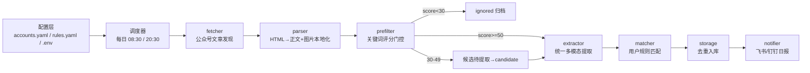
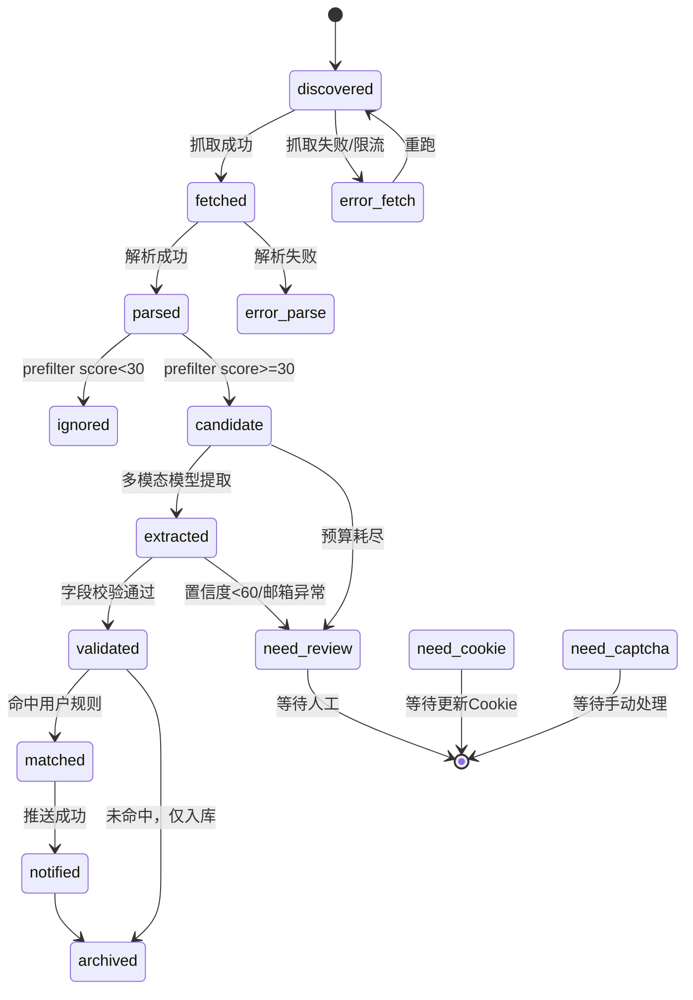

# WeHireMonitor 软件需求规格说明书

> 版本：v1.0 ｜ 日期：2026-06-28
> 来源：由《个人 AI 招聘情报监控平台 PRD》细化落地
> 架构取向：方案 C —— 分层单体 + 插件式抽象
> 部署形态：本地脚本为主，v1.0 起可选 Docker 容器化

---

## 0. 项目命名与定位

| 项    | 内容                                                          |
| ---- | ----------------------------------------------------------- |
| 项目名  | **WeHireMonitor**（中文别名：微岗哨）                                 |
| 仓库目录 | `wehire-monitor/`                                           |
| 含义   | We 扣微信生态、Hire 扣招聘、Monitor 扣监控；中文别名"微岗哨"（微/岗/哨）保留为 README 别称 |
| 定位   | 面向个人低频使用的微信公众号招聘情报监控管道：把"每天刷几十个公众号"变成"每天接收一份精准招聘日报"         |
| 非定位  | 非商业爬虫平台、不追求高并发/账号池/代理池、不绕强风控                          |

---

## 1. 关键设计决策（已锁定）

| 决策项         | 选定方案              | 落地影响                                                                     |
| ----------- | ----------------- | ------------------------------------------------------------------------ |
| 整体架构        | 方案 C：分层单体 + 插件式抽象 | 单 Python 包部署，内部分层严格、模块边界清晰，状态机驱动、可断点续跑                                   |
| 多模态模型供应商 | 可配置多供应商           | 抽象 `MultimodalProvider` 接口，`.env` 切换，默认 MiMo-V2.5（文本+图片统一） |
| 开源依赖        | 混合策略              | 解析层封装 `wechat-article-for-ai`；抓取层参考 `wechat_articles_spider` 思路自研        |
| 部署形态        | 本地脚本为主，可选容器化      | v0.1–v0.3 纯本地 cron/APScheduler；v1.0 补 Dockerfile                         |
| Cookie 获取    | 半自动扫码登录            | v0.4 新增 `login` 命令，纯 requests 调用微信扫码登录接口，自动获取 Cookie/Token 写入 `.env` |
| 细化范围        | 全量到 v1.0          | 本文覆盖 v0.1→v0.2→v0.3→v0.4→v1.0 全部阶段                                            |

---

## 2. 技术栈

### 2.1 语言与运行时

- **Python 3.11+**（类型提示、`enum`、`tomllib`、性能与生态兼顾）
- **包管理**：`uv`（快、现代、可生成 lockfile）；备选 `pip + venv`
- **Python 项目元数据**：`pyproject.toml`

### 2.2 核心依赖

| 领域          | 组件                                          | 版本建议       | 用途                                                                    |
| ----------- | ------------------------------------------- | ---------- | --------------------------------------------------------------------- |
| HTTP        | `httpx`                                     | ^0.27      | 抓取、Webhook、LLM API 调用（同步即可，低频）                                        |
| HTML 解析     | `beautifulsoup4` + `lxml`                   | ^4.12 / ^5 | 正文抽取自研兜底                                                              |
| 浏览器渲染兜底     | `playwright`                                | ^1.44      | HTML 解析失败时渲染（仅按需启用）                                                   |
| Markdown 转换 | 封装 `wechat-article-for-ai`，兜底 `markdownify` | -          | URL→Markdown + 图片本地化                                                  |
| 图片处理        | `Pillow` + `imagehash`                       | ^10 / ^4   | 图片拼接、切片、缩放、感知哈希去重                                                     |
| 数据校验        | `pydantic`                                  | ^2         | 配置校验、LLM JSON 输出校验、领域模型                                               |
| 存储          | `sqlite3`（标准库）                              | -          | 单文件数据库，纯驱动 + dataclass 映射                                             |
| 调度          | `apscheduler`                               | ^3.10      | 跨平台定时（Windows 友好）                                                     |
| 配置          | `pyyaml` + `python-dotenv`                  | ^6 / ^1    | YAML 规则 + .env 密钥                                                     |
| CLI         | `typer`                                     | ^0.12      | 控制台命令 `wehire-monitor`，子命令 `fetch/parse/prefilter/extract/notify/run` |
| 日志          | `loguru`                                    | ^0.7       | 结构化日志、文件轮转                                                            |
| 测试          | `pytest` + `pytest-mock`                    | ^8         | 单元 + 集成测试                                                             |

### 2.3 多模态模型供应商（默认实现）

| 角色       | 默认 Provider        | 备选                                   | 切换方式                   |
| -------- | ------------------ | ------------------------------------ | ---------------------- |
| 多模态模型    | MiMo-V2.5（小米）      | Qwen-VL-Max / GPT-4o / Claude Sonnet | `MULTIMODAL_PROVIDER=` |

多模态模型同时处理文本和图片，不再需要独立的 OCR 或文本 LLM。所有 Provider 经统一 `MultimodalProvider` 接口，Prompt 与 Provider 解耦（见 §7）。

---

## 3. 系统架构

### 3.1 分层总览

```
wehire-monitor/
├── cli/            # Typer 命令入口层
├── pipeline/       # 编排器：状态机推进、run_id、dry-run
├── modules/        # 业务模块层
│   ├── fetcher/    # 订阅与抓取
│   ├── parser/     # 解析与图片本地化
│   ├── prefilter/  # 关键词预过滤与评分
│   ├── extractor/  # 多模态模型统一提取（文本+图片）
│   ├── matcher/    # 用户规则匹配
│   ├── notifier/   # 飞书/钉钉推送
│   └── storage/    # SQLite 仓库
├── providers/      # 插件式抽象层
│   └── multimodal/ # MultimodalProvider 抽象 + 实现（统一文本+图片）
├── domain/         # 领域模型（dataclass/pydantic）
├── config/         # 配置加载与校验
├── infra/          # HTTP 客户端、限频器、重试、时钟
└── main.py
```

### 3.2 架构原则

1. **分层单体**：单一 Python 包，进程内调用；不引入消息队列/微服务。
2. **模块边界清晰**：每个 module 有一个明确职责、定义良好的入口函数、可独立 CLI 调用与单元测试。
3. **状态机驱动**：每篇文章是一个状态机实例，阶段间通过 SQLite 状态字段推进，可断点续跑、单独重跑。
4. **Provider 无关**：多模态模型经抽象 `MultimodalProvider` 接口，业务层只依赖接口，供应商经 `.env` 切换。
5. **成本控制前置**：预过滤门控 + 每日预算硬上限，两层把关。
6. **可观测**：每次运行生成 `run_id`，原始 HTML/Markdown/多模态模型 JSON 留档 7–30 天，`run_logs` 记录统计。

### 3.3 数据流



### 3.4 状态机



状态枚举（`domain/status.py`）：

```
discovered, fetched, parsed, ignored, candidate,
extracted, validated, matched, notified, archived,
error_fetch, error_parse, error_llm,
need_cookie, need_captcha, need_review
```

迁移由各模块在写库时显式调用 `storage.transition(article_id, from, to)`，迁移失败即异常。

---

## 4. 模块软件需求

> 每个模块给出：职责、输入契约、输出契约、接口签名、异常处理、依赖。

### 4.1 fetcher（订阅与抓取）

**职责**：基于手动维护的 Cookie/Token，调用微信公众平台后台接口，发现目标公众号近 24–36 小时新文章，输出文章元信息队列。

**接口签名**：

```python
class Fetcher:
    def check_cookie(self) -> CookieStatus  # 检测有效性+更新时间
    def search_account(self, name: str, alias: list[str]) -> AccountMeta
    def list_articles(self, account: AccountMeta, window_hours: int = 36) -> list[ArticleMeta]
    def run(self, accounts: list[AccountConfig]) -> FetchResult
```

**扫码登录接口**（v0.4 新增，独立于 Fetcher，放在 `modules/fetcher/wechat_login.py`）：

```python
class WeChatLogin:
    def is_cookie_valid(self) -> bool
    def login(self) -> LoginResult  # 弹出二维码 → 轮询扫码状态 → 获取 Cookie/Token
    def save_to_env(self, cookie: str, token: str) -> None  # 写入 .env
```

扫码登录流程（借鉴 CSDN 爬虫实战三方案，纯 requests 实现，无浏览器依赖）：

```
1. GET mp.weixin.qq.com 获取初始 Cookie（ua_id、uuid）
2. POST bizlogin?action=startlogin 初始化登录会话
3. GET scanloginqrcode?action=getqrcode 下载二维码图片，本地弹窗显示
4. 轮询 GET scanloginqrcode?action=ask 等待扫码（status: 0→未扫, 6→已扫待确认, 1→已确认）
5. POST bizlogin?action=login 完成登录，从 redirect_url 提取 token
6. GET redirect_url 获取完整 Cookie（slave_sid、data_ticket 等）
7. 持久化 Cookie/Token 到本地文件，有效期内复用
```

**输入契约**：`accounts.yaml` 条目 + `.env` 中 `WECHAT_MP_COOKIE/TOKEN/USER_AGENT`。

**输出契约**：

```python
@dataclass
class ArticleMeta:
    account_name: str
    title: str
    url: str
    publish_time: datetime
    source: Literal["wechat_mp_backend"]
```

**异常处理**（承接 PRD §8.1）：

| 异常        | 判断               | 处理                        | 状态             |
| --------- | ---------------- | ------------------------- | -------------- |
| Cookie 失效 | 登录页/401/token 无效 | 停止抓取，推送提醒                 | `need_cookie`  |
| 验证码       | 响应含验证码提示         | 当前任务暂停 6–12h，不重试          | `need_captcha` |
| 搜索不到      | name 失败→alias    | 仍失败记录 `account_not_found` | 跳过             |
| 限流        | 403/429/空响应      | 指数退避，单号跳过                 | 重试后跳过          |
| URL 重复    | URL hash 命中      | 不再解析                      | `archived`     |

**限频策略**（写入 `infra/rate_limiter.py`）：

- 公众号搜索间隔：随机 20–60s
- 文章抓取间隔：随机 5–20s
- 单次任务最大文章数：80；单号单次最多 10
- 每日任务 2 次：08:30、20:30
- 遇验证码：不换号、不持续重试

**依赖**：`httpx`、`infra/rate_limiter`、`infra/retry`、`storage`（去重查询）。参考 `wechat_articles_spider` 的 token/cookie 维护与限频思路，自研实现。

### 4.2 parser（解析与图片本地化）

**职责**：下载文章 HTML，抽取标题/作者/发布时间/正文文本/图片真实地址，下载图片到本地。

**接口签名**：

```python
class Parser:
    def parse(self, meta: ArticleMeta) -> ParsedArticle
```

**解析规则**（承接 PRD §8.2）：

- 正文容器优先 `#js_content`
- 图片地址优先级：`data-src` > `src` > `data-backsrc`
- 保留图片顺序、宽高、sha256
- 防盗链下载带 `Referer` + `User-Agent`
- 下载失败保留远程 URL，标记 `image_download_failed`
- HTML 解析失败 → 浏览器渲染兜底（playwright，按需启用）

**输出契约**：

```python
@dataclass
class ImageAsset:
    index: int
    url: str
    local_path: str | None
    width: int
    height: int
    sha256: str
    status: Literal["ok", "image_download_failed"]

@dataclass
class ParsedArticle:
    article_id: str  # sha256(url)
    title: str
    plain_text: str
    images: list[ImageAsset]
    content_hash: str
```

**依赖策略落地**：优先调用 `wechat-article-for-ai` 的 URL→Markdown + 图片本地化能力（封装为适配器 `parser/adapters/wechat_article_for_ai.py`）；适配器异常时回退自研 BeautifulSoup 解析（`parser/adapters/bs4_fallback.py`）。

### 4.3 prefilter（关键词预过滤与评分）

**职责**：基于标题/摘要/正文前 1000 字/图片 alt 文本，计算招聘分，门控是否进入 AI 提取。

**接口签名**：

```python
class Prefilter:
    def score(self, article: ParsedArticle) -> PrefilterResult
```

**评分公式**（承接 PRD §8.2）：

```
招聘分 = 标题命中*40 + 正文命中*30 + 投递词命中*20 + 邮箱/报名链接命中*10 - 排除词惩罚
```

**门控**：

- `score >= 50` → `candidate`，直接进入提取
- `30 <= score < 50` → `candidate`，候选待提取
- `score < 30` → `ignored`

**输出契约**：

```python
@dataclass
class PrefilterResult:
    score: int
    reasons: list[str]
    decision: Literal["extract", "ignore"]
```

强命中词/强排除词字典维护在 `config/keywords.yaml`，支持热更新。

### 4.4 extractor（AI 混合智能提取）

**职责**：对候选招聘文章，调用统一多模态模型提取结构化岗位，校验归一化。

**接口签名**：

```python
class Extractor:
    def extract(self, article: ParsedArticle, prefilter: PrefilterResult) -> ExtractionResult
```

**统一多模态提取逻辑**（承接 PRD §8.3.1）：

```
1. 短图拼接: 微信长图被拆成多张短图时拼回原图
2. 长图检测: 任一图片高度超过模型分辨率限制 → 长图切片
3. 统一多模态模型提取: 文本+图片同一模型同一 API
4. 预算检查: 每日成本超上限则转 need_review
```

多模态模型同时具备文本理解和图片识别能力，不再需要 OCR 中间步骤和三路切换逻辑。

**长图切片策略**（承接 PRD §8.3.2）：

- 最大切片高度 1800px（区间 1600–2200）
- 重叠 220px（区间 180–250）
- 原宽 >1440px 等比缩放到 1440px
- 每切片元信息：`image_index/slice_index/y_start/y_end`
- 底部含邮箱/二维码/报名方式切片强制保留
- 每篇最多 8 切片，超过先低分辨率预览找关键区域

**切片去重合并**：

```
岗位唯一键 = normalize(company) + normalize(job_name) + normalize(location)
相邻切片重复 → 保留字段更完整者
邮箱冲突 → 保留正则合法且置信度高者，标记 conflict
```

**Prompt**：统一多模态 Prompt 模板见 PRD §8.3.3，本项目将其外置为 `providers/prompts/*.txt`，与 Provider 解耦。

**输出契约**：

```python
@dataclass
class Job:
    company_name: str | None
    job_name: str | None
    location: str | None
    apply_channel: str | None
    email: str | None
    email_chars: list[str]
    deadline: Deadline  # {date, inferred}
    source_evidence: dict
    confidence: int  # 0-100

@dataclass
class ExtractionResult:
    article_type: Literal["social_recruitment","campus_recruitment","internship","non_recruitment","unknown"]
    jobs: list[Job]
    warnings: list[str]
    model_calls: int  # 多模态模型 API 调用次数
    cost_estimate: float  # 估算成本(元)
```

**后处理校验**：

- 邮箱正则：`[A-Za-z0-9._%+-]+@[A-Za-z0-9.-]+\.[A-Za-z]{2,}`
- `email` 与 `email_chars.join("")` 不一致 → 标记 `email_mismatch` → `need_review`
- 截止日期早于发布时间 → 标记异常
- 地点空但表格含城市词 → 二次抽取
- `confidence < 60` → 进复核区，不进主表

### 4.5 matcher（用户规则匹配）

**职责**：基于 `rules.yaml`，对提取出的岗位计算 `match_score`，决定是否推送。

**接口签名**：

```python
class Matcher:
    def match(self, jobs: list[Job]) -> list[MatchedJob]
```

**匹配维度**（承接 PRD §7.3）：locations / job_keywords / companies 的 include/exclude，加权得分，阈值 `notify_min_score`（默认 70）。

### 4.6 notifier（飞书/钉钉推送）

**职责**：组装日报，按 Webhook 推送，控制推送量与复核区。

**接口签名**：

```python
class Notifier:
    def send_daily(self, report: DailyReport) -> NotifyResult
```

**推送规则**（承接 PRD §8.4）：

- `match_score >= notify_min_score` 才推送
- `confidence < 60` 进"需复核"区
- 每次最多推送 20 条
- 无命中可配置是否推送"今日无新增"
- 推送内容不含 Cookie/token/完整隐私；邮箱可配置脱敏

**日报格式**：Markdown 表格 + 复核清单（见 PRD §8.4）。

### 4.7 storage（SQLite 仓库）

**职责**：领域对象持久化、去重查询、状态迁移、运行日志。

**接口签名**：

```python
class Repository:
    def upsert_article(self, a: Article) -> None
    def upsert_jobs(self, jobs: list[Job]) -> None
    def is_url_seen(self, url_hash: str) -> bool
    def transition(self, article_id: str, from_status: Status, to_status: Status) -> None
    def log_run(self, run: RunLog) -> None
    def query_for_notify(self) -> list[Job]
```

**去重策略**（承接 PRD §8.4）：

1. URL hash
2. 正文 hash
3. 图片 perceptual hash
4. 岗位 hash（公司+岗位+地点+截止日期）
5. 文章更新保留最新解析，不重复推送已通知岗位

---

## 5. 数据模型（SQLite Schema）

### 5.1 articles

```sql
CREATE TABLE articles (
  id TEXT PRIMARY KEY,                -- sha256(url)
  account_name TEXT NOT NULL,
  title TEXT NOT NULL,
  url TEXT NOT NULL,
  publish_time TEXT NOT NULL,         -- ISO8601
  content_hash TEXT,
  image_hashes TEXT,                  -- JSON array
  status TEXT NOT NULL,               -- 状态机值
  prefilter_score INTEGER,
  prefilter_reasons TEXT,             -- JSON array
  article_type TEXT,
  raw_html_path TEXT,
  markdown_path TEXT,
  created_at TEXT NOT NULL,
  updated_at TEXT NOT NULL
);
CREATE INDEX idx_articles_status ON articles(status);
CREATE INDEX idx_articles_publish_time ON articles(publish_time);
```

### 5.2 jobs

```sql
CREATE TABLE jobs (
  id TEXT PRIMARY KEY,                -- job hash
  article_id TEXT NOT NULL REFERENCES articles(id),
  company_name TEXT,
  job_name TEXT,
  location TEXT,
  apply_channel TEXT,
  email TEXT,
  deadline_date TEXT,
  deadline_inferred INTEGER,          -- 0/1
  confidence INTEGER,
  match_score INTEGER,
  source_evidence TEXT,               -- JSON
  warnings TEXT,                      -- JSON array
  notified_at TEXT,
  created_at TEXT NOT NULL,
  UNIQUE(company_name, job_name, location, deadline_date)
);
CREATE INDEX idx_jobs_article ON jobs(article_id);
CREATE INDEX idx_jobs_match_score ON jobs(match_score);
```

### 5.3 run_logs

```sql
CREATE TABLE run_logs (
  run_id TEXT PRIMARY KEY,
  started_at TEXT NOT NULL,
  ended_at TEXT,
  fetched_count INTEGER DEFAULT 0,
  candidate_count INTEGER DEFAULT 0,
  model_count INTEGER DEFAULT 0,     -- 多模态模型调用次数
  cost_estimate REAL DEFAULT 0,
  error_summary TEXT
);
```

### 5.4 images（图片资产登记）

```sql
CREATE TABLE images (
  id TEXT PRIMARY KEY,                -- sha256
  article_id TEXT NOT NULL REFERENCES articles(id),
  index_in_article INTEGER,
  url TEXT,
  local_path TEXT,
  width INTEGER,
  height INTEGER,
  status TEXT,
  created_at TEXT NOT NULL
);
```

---

## 6. 配置模型

### 6.1 accounts.yaml

```yaml
accounts:
  - name: "上海国资招聘"
    alias: ["上海国资", "国资招聘"]
    priority: high    # high|medium|low
    enabled: true
```

### 6.2 rules.yaml

```yaml
match_rules:
  locations:
    include: ["上海", "杭州", "苏州"]
    exclude: ["境外", "海外"]
  job_keywords:
    include: ["金融", "数据分析", "风控", "投研", "产品经理"]
    exclude: ["实习", "校招", "劳务派遣"]
  companies:
    include: ["银行", "证券", "基金", "国企", "央企"]
  notify_min_score: 70

notify:
  max_per_run: 20
  push_when_empty: false
  email_mask: true

schedule:
  daily_at: ["08:30", "20:30"]
  window_hours: 36
  max_articles_per_run: 80
  max_articles_per_account: 10

budget:
  daily_model_budget_cny: 5.0
  max_slices_per_article: 8
```

### 6.3 .env

```
WECHAT_MP_COOKIE=...
WECHAT_MP_TOKEN=...
WECHAT_USER_AGENT=...
COOKIE_UPDATED_AT=2026-06-28 08:00:00

MULTIMODAL_PROVIDER=mimo
MULTIMODAL_API_KEY=...
MULTIMODAL_MODEL=mimo-v2.5
MULTIMODAL_BASE_URL=https://api.xiaomimimo.com/v1

FEISHU_WEBHOOK=...
DINGTALK_WEBHOOK=...
```

配置加载由 `config/loader.py` 统一完成，`pydantic` 校验，启动时检测 Cookie 更新时间 >24h 则告警。

---

## 7. 多供应商抽象设计

### 7.1 接口定义

```python
# providers/multimodal/base.py
class MultimodalProvider(Protocol):
    name: str
    def extract_jobs(
        self,
        text: str | None,
        images: list[ImageSlice] | None,
        meta: ArticleMeta,
    ) -> ExtractionResult: ...
```

多模态模型同时处理文本和图片，一个接口替代原来的 LLMProvider + VLMProvider + OCRProvider。

### 7.2 工厂与切换

`providers/factory.py` 读取 `.env`，返回对应实现：

- `MULTIMODAL_PROVIDER=mimo` → `providers/multimodal/mimo.py`
- `MULTIMODAL_PROVIDER=qwen_vl` → `providers/multimodal/qwen_vl.py`
- `MULTIMODAL_PROVIDER=openai` → `providers/multimodal/openai.py`

新增供应商只需实现接口 + 注册工厂，业务层零改动。

### 7.3 Prompt 与 Provider 解耦

- Prompt 模板外置 `providers/prompts/multimodal.txt`
- 模板变量：`{{title}}`、`{{publish_time}}`、`{{content}}`、`{{image_index}}`、`{{slice_index}}`、`{{y_start}}`、`{{y_end}}`
- Provider 实现负责把模板 + 变量组装成自家 API 请求体，并解析返回为统一 `ExtractionResult`

---

## 8. 成本控制与风控

### 8.1 两层门控

1. **预过滤门控**：`score<30` 丢弃，`>=30` 进入提取。非招聘文章不进模型。
2. **预算硬上限**：`budget.daily_model_budget_cny` 耗尽即停止模型调用，剩余转 `need_review`。

### 8.2 指标

- 多模态模型使用低成本国产模型（如 MiMo-V2.5，0.7 元/百万输入 token）
- 长图切片处理，每篇最多 8 切片，不整篇上传
- `run_logs.cost_estimate` 每次记录

### 8.3 风控合规

- 仅个人信息整理，不公开再分发
- 尊重访问频率，遇风控立即降频/暂停
- 不绕强验证码，不做账号池/代理池
- Webhook 不推 Cookie/token/完整隐私

---

## 9. 分阶段实现计划（v0.1 → v1.0）

> 每阶段给出：目标、必做工作清单（颗粒到任务）、阶段验收、依赖关系。

### 9.1 MVP v0.1：能跑通

**目标**：手动 Cookie → 抓取 24–36h 文章 → HTML+图片抽取 → 关键词过滤 → SQLite 入库 → 飞书/钉钉推送标题和链接。

**必做工作**：

1. **项目骨架**
   - `pyproject.toml` + `uv` 初始化，锁定 Python 3.11
   - 目录结构按 §3.1 创建
   - `loguru` 日志配置（文件轮转 + 控制台）
   - `typer` CLI 主入口 `main.py`，注册 `run/fetch/parse/prefilter/notify/dry-run` 子命令骨架
2. **配置层**
   - `config/loader.py`：加载 `accounts.yaml`/`rules.yaml`/`.env`
   - `pydantic` 模型校验配置
   - 启动检测 Cookie 更新时间，>24h 告警
   - 提供示例 `accounts.yaml.example`/`rules.yaml.example`/`.env.example`
3. **领域模型**
   - `domain/`：`Article`、`ArticleMeta`、`ImageAsset`、`Status` 枚举、`RunLog`
4. **storage 仓库**
   - 建表 SQL（§5 articles/jobs/run_logs/images）
   - `Repository`：upsert/查询/状态迁移/run_log
   - URL hash 去重查询
5. **fetcher**
   - Cookie/Token 有效性检测
   - 公众号搜索（name→alias 兜底）
   - 文章列表抓取（近 window_hours）
   - 限频器 `infra/rate_limiter.py`（20–60s / 5–20s）
   - 异常处理表（Cookie 失效/验证码/限流/找不到）
   - 状态迁移：`discovered→fetched` / `error_fetch` / `need_cookie`
6. **parser**
   - 封装 `wechat-article-for-ai` 适配器（URL→Markdown + 图片本地化）
   - 自研 BS4 兜底解析器（`#js_content`、图片地址优先级）
   - 图片下载（Referer/UA、失败保留远程 URL）
   - 状态迁移：`fetched→parsed` / `error_parse`
7. **prefilter**
   - `config/keywords.yaml` 强命中词/强排除词
   - 评分公式实现
   - 门控决策
   - 状态迁移：`parsed→ignored/candidate`
8. **notifier**
   - 飞书/钉钉 Webhook 推送（Markdown 卡片）
   - v0.1 仅推送标题 + 链接 + 来源
   - 推送量控制（max_per_run）
9. **pipeline 编排**
   - `pipeline/runner.py`：按状态机串接 fetcher→parser→prefilter→notifier
   - 生成 `run_id`，写 `run_logs`
   - `dry-run` 模式（只读不推不写）
   - 单篇失败不影响整批
10. **调度**
    - `apscheduler` 每日 08:30/20:30 触发 `run`
    - Windows 兼容（备选 launchd/cron 文档）
11. **测试**
    - `fetcher`/`parser`/`prefilter` 关键单元测试（mock HTTP）
    - `storage` 状态迁移测试
    - 一条端到端 `dry-run` 集成测试
12. **文档**
    - `README.md`：安装、配置、运行、排障
    - `.env.example`、`accounts.yaml.example`、`rules.yaml.example`

**阶段验收**：

- 能对 ≥3 个真实公众号完成抓取→过滤→入库→推送标题链接
- Cookie 失效能 100% 推送提醒
- 单次任务 ≤45 分钟（20–30 个号）
- `dry-run` 可跑通且不产生副作用

**依赖**：无前置阶段。

---

### 9.2 MVP v0.2：能提取

**目标**：接入多模态模型，输出结构化岗位表，邮箱正则校验，用户规则匹配，日报升级为结构化表格。

**必做工作**：

1. **Provider 抽象层**
   - `providers/multimodal/base.py` + `providers/multimodal/mimo.py`（MiMo-V2.5 实现）
   - `providers/factory.py` 工厂切换
   - `.env` 增加 `MULTIMODAL_PROVIDER/MULTIMODAL_API_KEY/MULTIMODAL_MODEL/MULTIMODAL_BASE_URL`
2. **Prompt 模板**
   - `providers/prompts/multimodal.txt`（PRD §8.3.3）
   - 模板变量渲染
3. **extractor 统一提取**
   - 多模态模型同时处理文本和图片
   - 有图片时传图，无图片时传文本
   - 状态迁移：`candidate→extracted`
4. **JSON Schema 校验**
   - `pydantic` 模型 `ExtractionResult`/`Job`/`Deadline`
   - 模型输出 JSON 解析失败 → 重试 1 次 → `error_llm`
5. **后处理校验**
   - 邮箱正则 + `email` 与 `email_chars` 一致性 → 不一致 `email_mismatch`→`need_review`
   - 截止日期早于发布时间标记异常
   - `confidence<60` 进复核区
   - 地点空但含城市词二次抽取
6. **matcher**
   - `rules.yaml` 加载
   - locations/job_keywords/companies include/exclude 加权
   - `match_score` 计算，阈值门控
   - 状态迁移：`validated→matched/archived`
7. **notifier 升级**
   - 日报改为结构化岗位表（公司/岗位/地点/截止/投递/来源）
   - 复核区单独列出
   - 邮箱脱敏（`email_mask`）
8. **成本统计**
   - `run_logs` 记录 `model_count`/`cost_estimate`
   - CLI `run --stats` 查看本次统计
9. **测试**
    - `extractor` 统一提取测试（mock provider）
    - `matcher` 规则匹配测试
    - 邮箱校验边界测试
    - Provider 工厂切换测试

**阶段验收**：

- 邮箱提取准确率 ≥98%（不确定进复核）
- 公司/岗位/地点整体可用率 ≥90%
- 非招聘文章过滤准确率 ≥85%
- 招聘文章漏检率 ≤10%

**依赖**：v0.1 完成。

---

### 9.3 MVP v0.3：能处理长图

**目标**：短图拼接 + 长图切片 + 每日预算上限 + 置信度门控 + 人工复核队列。

**必做工作**：

1. **短图拼接**
   - `extractor/stitcher.py`：微信长图被拆成多张短图时拼回原图
   - 感知哈希去重、边界重叠检测、SVG 跳过、宽度分组
2. **长图识别与切片**
   - `extractor/slicer.py`：单图高度超过模型分辨率限制时触发
   - 切片参数：高度 1800px、重叠 220px、宽>1440 缩放
   - 切片元信息 `image_index/slice_index/y_start/y_end`
   - 底部含邮箱/二维码切片强制保留
   - 每篇最多 8 切片，超过先低分辨率预览找关键区域
3. **切片结果合并**
   - 切片结果合并去重（岗位唯一键、字段完整者优先、邮箱冲突标记）
   - 状态迁移：`candidate→extracted` / `need_review`
4. **预算硬上限**
   - `budget.daily_model_budget_cny` 读取
   - `extractor/budget.py` 累计花费，耗尽停止模型调用 → `need_review`
   - `max_slices_per_article` 限制
5. **人工复核队列**
   - `need_review` 状态文章列表 CLI：`wehire-monitor review --list`
   - 复核后手动标注/确认，状态推进
6. **成本统计完善**
   - `run_logs.model_count`/`cost_estimate`
   - 每日预算消耗展示
7. **测试**
   - 拼接算法测试（感知哈希、边界重叠、宽度分组）
   - 切片算法测试（边界、重叠、缩放）
   - 模型 mock 提取 + 合并去重测试
   - 预算耗尽停模型测试
   - 端到端长图文章处理测试

**阶段验收**：

- 长图招聘信息可结构化提取，岗位行列不错配
- 邮箱逐字符识别，不确定标记 `?` 进复核
- 每日模型花费 ≤预算上限
- 重复推送率 ≤1%

**依赖**：v0.2 完成。

---

### 9.4 v0.4：半自动扫码登录

**目标**：用 `wehire-monitor login` 命令替代手动 F12 复制粘贴 Cookie/Token，用户只需手机扫码，2-3 天一次。

**必做工作**：

1. **扫码登录模块**
   - `modules/fetcher/wechat_login.py`：纯 requests 实现微信扫码登录
   - 借鉴 CSDN 爬虫实战三方案，调用微信公众平台 `scanloginqrcode` 接口
   - 流程：获取初始 Cookie → startlogin → 下载二维码 → 弹窗显示 → 轮询扫码状态 → login → 提取 token → 获取完整 Cookie
   - 二维码图片用 Pillow 弹窗显示（`Image.show()`）
   - 轮询间隔 2 秒，超时 120 秒
2. **Cookie 持久化与复用**
   - Cookie/Token 保存到本地文件（`data/wechat_cookie.json`）
   - 启动时先检测已有 Cookie 是否有效（调用 `scanloginqrcode?action=ask` 检查 `base_resp.ret`）
   - 有效则直接复用，无效才触发扫码
3. **CLI 命令**
   - `wehire-monitor login`：执行扫码登录，成功后写入 `.env`
   - 登录成功后自动更新 `COOKIE_UPDATED_AT` 时间戳
4. **Cookie 过期处理优化**
   - `is_cookie_stale()` 阈值从 24h 调整为 48h（实测 Cookie 可维持 2-3 天）
   - Cookie 失效时不报错退出，改为跳过抓取阶段、继续执行提取阶段处理已有文章
   - 日志输出醒目提醒："Cookie 已失效，请运行 `wehire-monitor login` 重新登录"
5. **测试**
   - 扫码登录流程 mock 测试（mock HTTP 响应）
   - Cookie 持久化与复用测试
   - Cookie 失效时的降级逻辑测试

**阶段验收**：

- `wehire-monitor login` 能弹出二维码，扫码后自动获取 Cookie/Token 并写入 `.env`
- Cookie 有效期内（≥2 天）连续运行无需重新登录
- Cookie 失效时系统不崩溃，跳过抓取继续处理已有文章
- 手动 F12 复制粘贴方式仍作为兜底保留

**依赖**：v0.3 完成。

---

### 9.5 v1.0：稳定日用

**目标**：运行看板、成本统计、错误告警、配置向导、一键重跑、可选容器化。

**必做工作**：

1. **本地 HTML 报告/看板**
   - `notifier/report.py` 生成 `data/report.html`
   - 内容：每日抓取/候选/命中/模型花费趋势、错误分布、复核队列
   - CLI `wehire-monitor report --open`
2. **周报统计**
   - 每周自动汇总：抓取数、命中数、误报数、模型花费
   - 推送周报到飞书/钉钉
3. **错误告警**
   - Cookie 失效、连续失败、预算异常 → 即时推送告警
4. **配置向导**
   - CLI `wehire-monitor init`：交互式生成 `accounts.yaml`/`rules.yaml`/`.env`
5. **一键重跑失败任务**
   - CLI `wehire-monitor rerun --status error_*`
   - 按状态机从失败点续跑
6. **Docker 容器化（可选）**
   - `Dockerfile` + `docker-compose.yml`
   - 数据卷挂载 `data/`、`config/`、`.env`
   - 支持 `docker compose run wehire-monitor run`
7. **数据归档与清理**
   - 原始 HTML/Markdown/多模态模型 JSON 留档 7–30 天自动清理
   - SQLite 可选加密备份
8. **可观测增强**
   - 日志中邮箱脱敏
   - `run_logs` 历史查询 CLI
9. **测试与文档**
   - 集成测试覆盖 v1.0 新功能
   - `README` 更新部署/运维章节
   - 排障手册（Cookie/验证码/限流/预算）

**阶段验收**：

- 连续 7 天稳定运行无需人工干预（除 Cookie 更新）
- 看板可查看 7 天趋势
- 失败任务可一键重跑
- Docker 镜像可一键启动并跑通 `run`
- 全部 PRD §12 验收指标达标

**依赖**：v0.3 完成。

---

## 10. 非功能性需求（落地）

| 维度  | 要求                              | 落地                          |
| --- | ------------------------------- | --------------------------- |
| 成本  | 每日预算上限、多模态模型低成本（MiMo-V2.5）  | 两层门控 + `budget` 配置          |
| 稳定  | 单篇失败不影响整批、可重跑、状态机推进             | 状态机 + `run_id` + 原始留档       |
| 风控  | 低频、不绕验证码、不账号池、遇风控降频             | 限频器 + 异常处理表                 |
| 安全  | Cookie/Key 入 `.env`、不入日志、邮箱可脱敏  | `python-dotenv` + loguru 过滤 |
| 可维护 | YAML 规则、每模块 CLI、dry-run、周报      | Typer 子命令 + YAML 配置         |

---

## 11. 验收指标（承接 PRD §12）

| 指标              | 目标          |
| --------------- | ----------- |
| 非招聘文章过滤准确率      | ≥85%        |
| 招聘文章漏检率         | ≤10%        |
| 邮箱提取准确率         | ≥98%，不确定进复核 |
| 公司/岗位/地点整体可用率   | ≥90%        |
| 单次任务耗时（20–30 号） | ≤45 分钟      |
| 每日模型调用成本  | ≤预算上限        |
| 重复推送率           | ≤1%         |
| Cookie 失效可感知    | 100% 推送提醒   |
| 扫码登录成功率      | ≥95%（网络正常时）  |

---

## 12. 风险与对策（承接 PRD §14）

| 风险          | 影响       | 对策                       |
| ----------- | -------- | ------------------------ |
| 微信后台接口变动    | URL 发现失效 | 保留手动 URL 导入、第三方聚合号解析降级   |
| Cookie 频繁失效 | 任务中断     | 半自动扫码登录（`login` 命令），2-3 天扫一次码；失效时跳过抓取不中断提取     |
| 验证码         | 无法继续抓取   | 暂停任务，不强行重试               |
| 长图识别错位   | 岗位字段错配   | 短图拼接 + 长图切片 + 多模态模型 + 证据字段 |
| 模型成本不可控   | 花费上升     | 每日预算、切片上限、预过滤门控           |
| 邮箱识别错误      | 投递失败     | 逐字符输出 + 正则 + 不确定复核       |
| 误推校招/实习     | 干扰用户     | 强排除词 + `article_type` 分类 |
| 开源依赖上游变动    | 解析层失效    | 适配器 + 自研 BS4 兜底          |

---

## 13. 目录结构（细化）

```
wehire-monitor/
  config/
    accounts.yaml
    rules.yaml
    keywords.yaml
    .env
  data/
    job_intel.sqlite
    raw_html/
    markdown/
    images/
    model_outputs/
    report.html
  src/wehire_monitor/
    cli/
    pipeline/
    modules/
      fetcher/
      parser/
        adapters/
      prefilter/
      extractor/
      matcher/
      notifier/
      storage/
    providers/
      multimodal/
      prompts/
      factory.py
    domain/
    config/
    infra/
    main.py
  tests/
  logs/
  pyproject.toml
  Dockerfile
  docker-compose.yml
  README.md
```

---

## 14. 参考来源

- `wnma3mz/wechat_articles_spider`：URL 获取、token/cookie 维护、限频思路参考（抓取层自研）
- `bzd6661/wechat-article-for-ai`：URL→Markdown、图片本地化、验证码检测、重试（解析层适配器封装）
- 小米 MiMo-V2.5：默认多模态模型，文本+图片统一理解，OpenAI 兼容 API
- 阿里 Qwen-VL-Max：备选多模态模型，视觉理解 + 文本生成
- 微信公众平台扫码登录接口分析：纯 requests 实现扫码登录，v0.4 登录模块参考
- `opendatalab/MinerU`：v1.0 后续复杂排版增强备选
