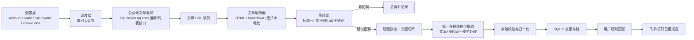
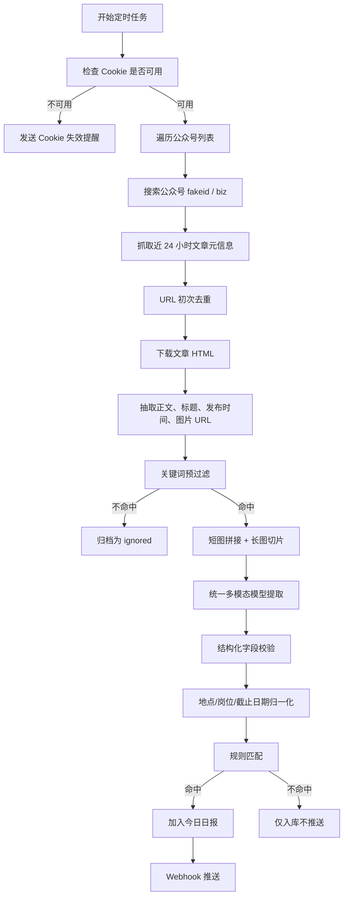
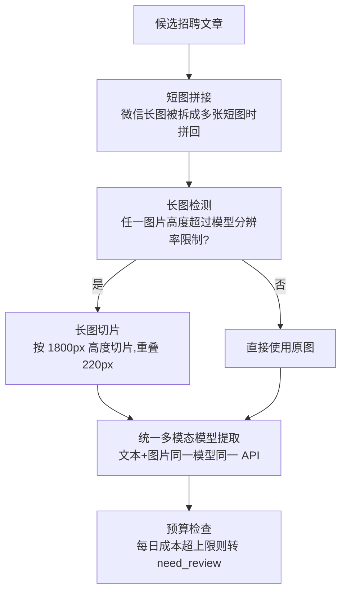

下面是一份面向个人低频使用的 PRD。选型上我查了现有项目：`wnma3mz/wechat_articles_spider` 适合借鉴公众号 URL 获取、手动参数维护和低频抓取思路；`bzd6661/wechat-article-for-ai` 更适合做单篇文章转 Markdown、图片本地化、验证码识别和重试；AI 提取默认建议用多模态模型（如 MiMo-V2.5），同时处理文本和图片。参考来源见文末。

# 个人 AI 招聘情报监控平台 PRD

## 1. 产品定位

产品名称：个人 AI 招聘情报监控平台  
目标用户：关注金融、国企、央企、垂直社招机会的个人求职者  
核心价值：把“每天刷几十个公众号”变成“每天接收一份精准招聘日报”。

本产品不是商业爬虫平台，不追求高并发、全自动账号体系、复杂 Cookie 池，而是一个低频、轻量、可人工维护的本地自动化管道。

## 2. 产品目标

1. 自动发现 20-30 个目标公众号过去 24 小时内的新文章。
2. 自动过滤非招聘内容，减少无效文章处理成本。
3. 对正文、普通图文、复杂长图招聘海报进行分层解析。
4. 结构化提取公司、岗位、地点、投递渠道、截止日期。
5. 基于用户偏好推送每日精准招聘日报到飞书/钉钉。
6. 通过关键词预过滤和每日预算上限，将多模态模型调用成本控制在可接受范围。

## 3. 范围边界

### In Scope

- 公众号订阅列表维护。
- 微信公众平台后台 Cookie 手动配置或半自动扫码登录。
- 低频定时抓取文章标题、发布时间、URL。
- 文章 HTML 解析、正文抽取、图片本地化。
- 关键词预过滤。
- 统一多模态模型结构化提取（文本和图片由同一模型处理）。
- 长图切片处理（超长图超过模型分辨率限制时切片）。
- SQLite 存储、去重、日志。
- 飞书/钉钉 Webhook 推送。

### Out of Scope

- Cookie 池、代理池、账号池。
- 商业化多用户后台。
- 高频实时监控。
- 绕过强验证码或强风控。
- 对微信接口做大规模探测。

## 4. 开源组件选型

| 模块        | 推荐组件                             | 用法                               | 说明                                    |
| --------- | -------------------------------- | -------------------------------- | ------------------------------------- |
| 公众号文章发现   | `wnma3mz/wechat_articles_spider` | 借鉴 URL 获取、token/cookie 手动维护、限频策略 | 项目 README 明确偏学习实践，适合二次封装而非直接开箱即用      |
| 单篇文章解析    | `bzd6661/wechat-article-for-ai`  | URL 转 Markdown、图片下载、本地化、验证码提示    | 自带 Camoufox、重试、图片本地化、MCP/CLI，适合做解析层零件 |
| 多模态模型（默认） | `MiMo-V2.5`（小米）                  | 文本和图片统一理解，OpenAI 兼容 API          | 0.7 元/百万输入 token，原生多模态，成本极低           |
| 多模态模型（备选） | `Qwen-VL-Max` / `GPT-4o`         | 视觉理解 + 文本生成                      | 通过统一 `MultimodalProvider` 接口切换，业务层零改动 |
| 复杂文档解析    | `MinerU`                         | v1 不默认接入，可做复杂排版后续增强              | 对 PDF/Office/复杂文档强，但对本项目可能偏重          |
| 存储        | SQLite                           | 本地单文件数据库                         | 够用、易备份                                |
| 调度        | APScheduler / cron               | 每日 1-2 次                         | Windows 可用任务计划程序                      |
| 通知        | 飞书/钉钉 Webhook                    | Markdown/表格卡片                    | 无需自建 App                              |

## 5. 整体架构图

```


```
## 6. 核心业务流程
```



```
## 7. 配置设计

### 7.1 公众号订阅配置
```

accounts:

- name: "上海国资招聘"
  alias: ["上海国资", "国资招聘"]
  priority: high
  enabled: true

- name: "金融招聘信息"
  priority: medium
  enabled: true
  
  ```
  
  ```

字段说明：

| 字段         | 类型       | 必填  | 说明         |
| ---------- | -------- | --- | ---------- |
| `name`     | string   | 是   | 公众号名称      |
| `alias`    | string[] | 否   | 搜索失败时备用关键词 |
| `priority` | enum     | 否   | 抓取优先级      |
| `enabled`  | bool     | 是   | 是否启用       |

### 7.2 Cookie 配置

```
WECHAT_MP_COOKIE="xxx"
WECHAT_MP_TOKEN="xxx"
WECHAT_USER_AGENT="Mozilla/5.0 ..."
COOKIE_UPDATED_AT="2026-06-28 08:00:00"
```

产品要求：

- 首页/CLI 启动前检测 Cookie 更新时间。
- Cookie 有效期约 2-3 天，超过阈值提示用户重新登录。
- 提供 `wehire-monitor login` 命令，调用微信扫码登录接口自动获取 Cookie/Token 并写入 `.env`，用户只需手机扫码确认，无需手动 F12 复制粘贴。
- Cookie 本地持久化，有效期内复用，失效时才需重新扫码。
- Cookie 不入库明文展示，仅本地 `.env` 保存。

### 7.3 用户匹配规则

```
match_rules:
  locations:
    include: ["上海", "杭州", "苏州"]
    exclude: ["境外", "海外"]
  job_keywords:
    include: ["金融", "数据分析", "风控", "投研", "产品经理"]
    exclude: ["实习", "校招", "劳务派遣"]
  companies:
    include: ["银行", "证券", "基金", "国企", "央企"]
  notify_min_score: 70
```

## 8. 模块需求

## 8.1 订阅与数据抓取模块

### 功能描述

用户维护目标公众号列表，系统每天 1-2 次通过微信公众平台后台能力获取目标号近 24 小时文章。

优先实现路径：

1. 用户登录 `mp.weixin.qq.com`。
2. 手动复制 Cookie 和 token。
3. 系统调用新建图文/超链接时的公众号搜索接口，获取目标公众号标识。
4. 再获取目标公众号最近文章列表。
5. 只保留发布时间在最近 24-36 小时内的文章，36 小时用于容错。

### 输入

```
{
  "account_name": "上海国资招聘",
  "cookie": "***",
  "token": "***",
  "time_window_hours": 36
}
```

### 输出

```
{
  "account_name": "上海国资招聘",
  "articles": [
    {
      "title": "某某集团2026年社会招聘公告",
      "url": "https://mp.weixin.qq.com/s/xxx",
      "publish_time": "2026-06-28T09:30:00+08:00",
      "source": "wechat_mp_backend"
    }
  ]
}
```

### 异常处理

| 异常                 | 判断方式               | 处理                         |
| ------------------ | ------------------ | -------------------------- |
| Cookie 失效          | 返回登录页、401、token 无效 | 停止抓取，推送“请更新 Cookie”        |
| `captcha_required` | 响应字段或页面包含验证码提示     | 当前任务暂停 6-12 小时，不重试轰炸       |
| 搜索不到公众号            | name 失败后尝试 alias   | 仍失败则记录 `account_not_found` |
| 接口限流               | 频繁 403/429/空响应     | 指数退避，单号跳过                  |
| URL 重复             | URL hash 命中        | 不再解析                       |

### 防封频策略

- 每个公众号搜索间隔：随机 20-60 秒。
- 每个文章抓取间隔：随机 5-20 秒。
- 单次任务最大抓取文章数：默认 80。
- 单公众号单次最多文章数：默认 10。
- 遇到验证码后不自动换账号、不持续重试。
- 每日任务次数默认 2 次：08:30、20:30。

## 8.2 内容解析与预过滤模块

### 功能描述

对文章 URL 进行解析，提取标题、作者、发布时间、正文文本、图片真实地址，并下载图片到本地。

建议直接封装 `wechat-article-for-ai` 的 URL 转 Markdown 和图片本地化能力。该项目已有批处理、图片下载、验证码检测、重试等能力，适合作为文章解析底座。

### 解析规则

- 正文容器优先：`#js_content`。
- 图片地址优先级：`data-src` > `src` > `data-backsrc`。
- 保留图片顺序、宽高、文件 hash。
- 对防盗链图片下载时带 Referer、User-Agent。
- 下载失败保留远程 URL，状态标记为 `image_download_failed`。
- HTML 解析失败时使用浏览器渲染兜底。

### 预过滤策略

标题、摘要、正文前 1000 字、图片 alt 文本共同参与判断。

强命中词：

```
招聘、社招、社会招聘、公开招聘、人才招聘、岗位、职位、应聘、报名、投递、简历、录用
```

强排除词：

```
校招、校园招聘、实习生、宣讲会、培训班、党建、会议、新闻、活动回顾、获奖、公告公示但无岗位
```

判定逻辑：

```
招聘分 = 标题命中 * 40 + 正文命中 * 30 + 投递词命中 * 20 + 邮箱/报名链接命中 * 10 - 排除词惩罚
招聘分 >= 50 进入 AI 提取
招聘分 30-49 进入候选待提取
招聘分 < 30 丢弃
```

### 输出

```
{
  "article_id": "sha256(url)",
  "title": "某某集团社会招聘公告",
  "plain_text": "...",
  "images": [
    {
      "index": 1,
      "url": "https://mmbiz.qpic.cn/...",
      "local_path": "data/images/xxx.jpg",
      "width": 1080,
      "height": 5600,
      "sha256": "..."
    }
  ],
  "pre_filter_score": 82,
  "pre_filter_reason": ["标题命中社会招聘", "正文包含投递邮箱"]
}
```

## 8.3 AI 混合智能提取模块

### 8.3.1 统一多模态提取逻辑

多模态模型同时具备文本理解和图片识别能力，不再需要 OCR 中间步骤。提取流程简化为单路：



相比 v0.2/v0.3 的三路切换（文本 LLM → OCR+LLM → VLM），统一多模态方案的优势：

- 去掉 OCR 中间步骤，模型直接识别图片文字，准确率更高
- 去掉 OCR 质量评分和阈值判断，架构更简单
- 一个模型一个 API，降低维护复杂度
- MiMo-V2.5 等国产多模态模型成本极低（0.7 元/百万输入 token），比分别调用 DeepSeek + Qwen-VL 更经济

### 8.3.2 长图切片策略

目标：减少多模态模型单次输入压力，同时避免岗位表格跨切片丢失上下文。

规则：

- 最大切片高度：1600-2200 px，默认 1800 px。
- 重叠区域：上下一共 180-250 px，默认 220 px。
- 保持原宽，不缩放到文字不可读。
- 若原图宽度 > 1440 px，等比缩放到 1440 px。
- 每张切片添加元信息：`image_index`、`slice_index`、`y_start`、`y_end`。
- 先对每个切片提取局部岗位，再做合并去重。
- 对包含邮箱、二维码、报名方式的底部切片强制保留。
- 多模态模型每篇文章最多处理 8 个切片，超过则先低分辨率预览找关键区域。

切片去重合并：

```
岗位唯一键 = normalize(company) + normalize(job_name) + normalize(location)
相邻切片重复岗位：保留字段更完整者
邮箱冲突：保留正则合法且置信度更高者，并标记 conflict
```

### 8.3.3 统一多模态 Prompt

多模态模型同时接收文本和图片，使用同一套 Prompt 模板。有图片时附带图片，无图片时仅传文本。

System Prompt：

```
你是招聘信息结构化抽取助手。只从用户提供的正文或图片中抽取明确出现的信息，不要猜测、不要补全、不要编造。
如果字段不存在，输出 null。邮箱必须逐字符输出，并额外输出 email_chars 数组。
返回严格 JSON，不要 Markdown。
```

User Prompt：

```
请从以下微信公众号招聘文章中提取招聘岗位信息。文章可能包含正文文本和图片，图片中的文字同样需要识别和提取。

抽取字段：
- company_name: 公司名称
- job_name: 岗位名称
- location: 工作地点
- apply_channel: 投递邮箱、报名链接、二维码说明或其他投递方式
- email: 邮箱；必须逐字符准确输出
- email_chars: 邮箱字符数组，例如 ["h","r","@","x",".","c","o","m"]
- deadline: 截止日期，统一 YYYY-MM-DD；无明确年份时结合文章发布时间推断，并标记 inferred=true
- source_evidence: 每个字段对应的原文短证据（文本片段或图片区域描述）
- confidence: 0-100

要求：
1. 一篇文章可能包含多个岗位，输出 jobs 数组。
2. 不抽取校招、实习、宣讲会、培训类信息。
3. 如果是报名链接或二维码，没有邮箱，也要保留 apply_channel。
4. 邮箱必须通过正则校验；无法确认时 email=null，但在 apply_channel 中保留原始片段。
5. 图片中的岗位表格需保留行列对应关系，不要把相邻行的地点/岗位串错。
6. 如果图片中某个字符不确定，用 ? 标记，并在 warnings 中说明。
7. 不要根据常识补全公司名、地点或截止日期。

文章发布时间：{{publish_time}}
文章标题：{{title}}
正文：
{{content}}

{{#images}}
[图片 {{image_index}}] slice_index={{slice_index}} y_range={{y_start}}-{{y_end}}
{{/images}}
```

JSON Schema：

```
{
  "article_type": "social_recruitment | campus_recruitment | internship | non_recruitment | unknown",
  "jobs": [
    {
      "company_name": "string|null",
      "job_name": "string|null",
      "location": "string|null",
      "apply_channel": "string|null",
      "email": "string|null",
      "email_chars": ["string"],
      "deadline": {
        "date": "YYYY-MM-DD|null",
        "inferred": false
      },
      "source_evidence": {
        "company_name": "string|null",
        "job_name": "string|null",
        "location": "string|null",
        "apply_channel": "string|null",
        "deadline": "string|null"
      },
      "confidence": 0
    }
  ],
  "warnings": []
}
```

后处理校验：

- 合并所有切片结果，按岗位唯一键去重。
- 邮箱正则校验：`[A-Za-z0-9._%+-]+@[A-Za-z0-9.-]+\.[A-Za-z]{2,}`。
- `email` 与 `email_chars.join("")` 不一致时标记 `email_mismatch`，进入人工复核。
- 截止日期早于文章发布时间时标记异常。
- 地点为空但岗位表格中有“上海/北京/深圳”等城市词时二次抽取。

## 8.4 数据落地与通知模块

### SQLite 表设计

`articles`

| 字段             | 说明                               |
| -------------- | -------------------------------- |
| `id`           | URL sha256                       |
| `account_name` | 来源公众号                            |
| `title`        | 标题                               |
| `url`          | 原文链接                             |
| `publish_time` | 发布时间                             |
| `content_hash` | 正文 hash                          |
| `image_hashes` | 图片 hash 列表                       |
| `status`       | ignored/extracted/notified/error |
| `created_at`   | 入库时间                             |

`jobs`

| 字段              | 说明       |
| --------------- | -------- |
| `id`            | job hash |
| `article_id`    | 文章 ID    |
| `company_name`  | 公司       |
| `job_name`      | 岗位       |
| `location`      | 地点       |
| `apply_channel` | 投递方式     |
| `email`         | 邮箱       |
| `deadline`      | 截止日期     |
| `confidence`    | 置信度      |
| `match_score`   | 用户规则匹配分  |
| `notified_at`   | 推送时间     |

`run_logs`

| 字段                | 说明        |
| ----------------- | --------- |
| `run_id`          | 任务 ID     |
| `started_at`      | 开始时间      |
| `ended_at`        | 结束时间      |
| `fetched_count`   | 抓取文章数     |
| `candidate_count` | 候选招聘数     |
| `model_count`     | 多模态模型调用次数 |
| `error_summary`   | 错误摘要      |

### 去重策略

多重去重：

1. URL hash 去重。
2. 正文 hash 去重。
3. 图片 perceptual hash 去重。
4. 岗位 hash 去重：公司 + 岗位 + 地点 + 截止日期。
5. 同一文章更新时保留最新解析结果，但不重复推送已通知岗位。

### 通知内容

飞书/钉钉日报格式：

```
今日精准招聘日报｜2026-06-28

命中岗位 5 个，候选文章 12 篇，模型调用 2 次。

| 公司 | 岗位 | 地点 | 截止日期 | 投递方式 | 来源 |
|---|---|---|---|---|---|
| 某某证券 | 数据分析岗 | 上海 | 2026-07-10 | hr@example.com | 原文链接 |

需人工复核：
- 某某集团：邮箱字符不确定 xxx@?.com
```

推送规则：

- `match_score >= notify_min_score` 才推送。
- `confidence < 60` 不进入主表，进入“需复核”区。
- 每次任务最多推送 20 条，避免刷屏。
- 无命中时可配置是否推送“今日无新增”。

## 9. 非功能性需求

### 9.1 成本控制

- 非招聘文章不得进入多模态模型（预过滤门控）。
- 多模态模型使用低成本国产模型（如 MiMo-V2.5，0.7 元/百万输入 token）。
- 长图切片处理，每篇最多 8 个切片，不整篇无脑上传。
- 每日预算上限可配置，例如 5 元/日，超过即停止模型调用，改为待复核。
- 短图拼接减少图片数量，降低 API 调用次数。

### 9.2 稳定性

- 单篇文章失败不影响整批任务。
- 所有阶段可重跑，基于状态机推进。
- 每次运行生成 `run_id`，便于排查。
- 原始 HTML、Markdown、多模态模型 JSON 均本地留档 7-30 天。

### 9.3 风控与合规

- 仅用于个人信息整理，不做公开再分发。
- 尊重目标网站访问频率，不高频抓取。
- 不绕过强验证码。
- 不做账号池、代理池。
- 遇到风控立即降频或暂停。
- Webhook 不推送 Cookie、token、完整隐私信息。

### 9.4 安全

- Cookie、API Key 放 `.env`，不写入日志。
- SQLite 本地保存，可选加密备份。
- 通知内容默认只发摘要和原文链接。
- 日志中邮箱可配置脱敏展示。

### 9.5 可维护性

- 所有规则 YAML 化。
- 每个模块 CLI 可单独运行：
  - `fetch`
  - `parse`
  - `prefilter`
  - `extract`
  - `notify`
- 保留 `dry-run` 模式，便于调试。
- 每周自动生成运行统计：抓取数、命中数、误报数、模型花费。

## 10. 关键状态机

```
discovered
 -> fetched
 -> parsed
 -> ignored
 -> candidate
 -> extracted
 -> validated
 -> matched
 -> notified
 -> archived

error_fetch / error_parse / error_llm / need_cookie / need_captcha / need_review
```

## 11. MVP 版本规划

### MVP v0.1：能跑通

- 手动维护公众号列表。
- 手动 Cookie。
- 抓取近 24-36 小时文章 URL。
- HTML 正文 + 图片抽取。
- 关键词过滤。
- SQLite 入库。
- 飞书/钉钉推送标题和链接。

### MVP v0.2：能提取

- 接入多模态模型（文本+图片统一理解）。
- 输出结构化岗位表。
- 邮箱正则校验。
- 用户规则匹配。

### MVP v0.3：能处理长图

- 短图拼接（微信长图被拆成多张短图时拼回）。
- 长图切片策略。
- 每日预算上限。
- 置信度和人工复核队列。

### v0.4：半自动扫码登录

- `wehire-monitor login` 命令：纯 requests 调用微信扫码登录接口，自动获取 Cookie/Token。
- 用户只需手机扫码确认，无需手动 F12 复制粘贴。
- Cookie 本地持久化，有效期内（约 2-3 天）自动复用。
- Cookie 失效时自动检测并提示重新登录，不中断已有文章的提取流程。
- 借鉴现有开源方案（CSDN 爬虫实战三），不重复造轮子。

### v1.0：稳定日用

- 运行看板或本地 HTML 报告。
- 成本统计。
- 错误告警。
- 配置向导。
- 一键重跑失败任务。

## 12. 验收指标

| 指标            | 目标               |
| ------------- | ---------------- |
| 非招聘文章过滤准确率    | ≥ 85%            |
| 招聘文章漏检率       | ≤ 10%            |
| 邮箱提取准确率       | ≥ 98%，不确定则进入复核   |
| 公司/岗位/地点整体可用率 | ≥ 90%            |
| 单次任务耗时        | 20-30 个号 ≤ 45 分钟 |
| 每日模型调用成本      | ≤ 预算上限（默认 5 元/日） |
| 重复推送率         | ≤ 1%             |
| Cookie 失效可感知  | 100% 推送提醒        |

## 13. 推荐落地目录

```
job-intel/
  config/
    accounts.yaml
    rules.yaml
  data/
    job_intel.sqlite
    raw_html/
    markdown/
    images/
    ocr/
    llm_outputs/
  src/
    fetcher/
    parser/
    prefilter/
    extractor/
    notifier/
    storage/
  logs/
  .env
  main.py
```

## 14. 主要风险与对策

| 风险          | 影响       | 对策                              |
| ----------- | -------- | ------------------------------- |
| 微信后台接口变动    | URL 发现失效 | 保留手动 URL 导入、第三方聚合号文章解析作为降级      |
| Cookie 频繁失效 | 任务中断     | 半自动扫码登录（`login` 命令），2-3 天扫一次码即可 |
| 验证码         | 无法继续抓取   | 暂停任务，不强行重试                      |
| 长图识别错位      | 岗位字段错配   | 短图拼接 + 长图切片 + 多模态模型 + 证据字段      |
| 模型成本不可控     | 花费上升     | 每日预算、切片上限、预过滤门控                 |
| 邮箱识别错误      | 投递失败     | 逐字符输出 + 正则 + 不确定复核              |
| 误推校招/实习     | 干扰用户     | 强排除词 + article_type 分类          |

## 15. 参考来源

- `wnma3mz/wechat_articles_spider`：微信公众号文章爬虫项目，README 提到手动参数、低频间隔、不可实时/自动登录等约束，适合作为 URL 获取思路参考。  
  [GitHub](https://github.com/wnma3mz/wechat_articles_spider)

- `bzd6661/wechat-article-for-ai`：微信公众号文章转 Markdown，支持 Camoufox、重试、验证码检测、图片本地化、批处理和 MCP。  
  [GitHub](https://github.com/bzd6661/wechat-article-for-ai)

- 小米 MiMo-V2.5：原生多模态大模型，支持文本/图片/视频/音频输入，OpenAI 兼容 API，0.7 元/百万输入 token。  
  https://api.xiaomimimo.com/v1

- 阿里 Qwen-VL-Max：通义千问视觉理解模型，备选多模态方案，3 元/百万输入 token。  
  https://help.aliyun.com/zh/dashscope/developer-reference/use-qwen-by-calling-api

- `opendatalab/MinerU`：复杂文档转 Markdown/JSON，可作为后续复杂排版增强备选。  
  [GitHub](https://github.com/opendatalab/MinerU)

- 微信公众平台扫码登录接口分析：纯 requests 实现扫码登录自动获取 Cookie/Token，无需浏览器自动化。  
  [CSDN](https://blog.csdn.net/qq_44780372/article/details/143250640)
